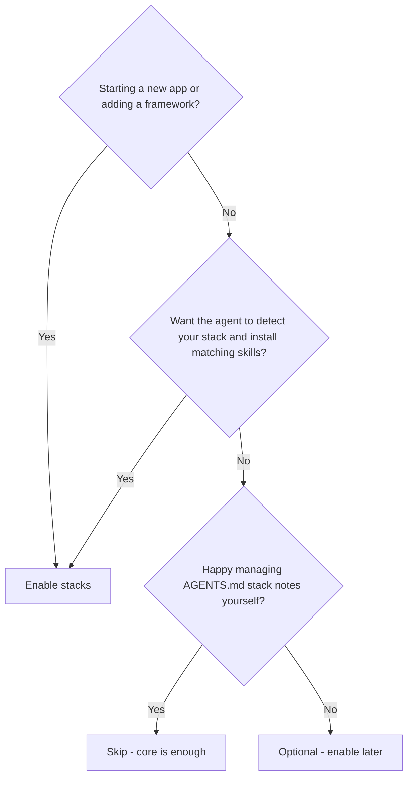
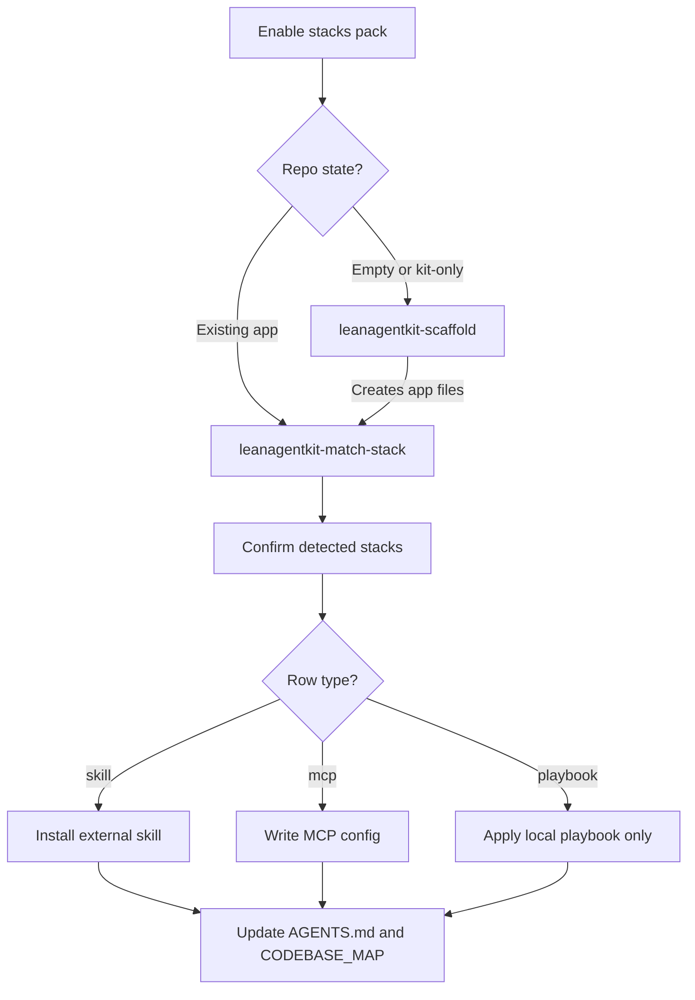

Requires the **stacks** pack:

```bash
npx create-lean-agent-kit@latest . --enable-pack stacks
```

## What it is

The stacks pack teaches your agent about the frameworks and tools in your repo.
It can **detect** what you already use (Next.js, Hono, Prisma, …) and wire matching
skills and conventions into `AGENTS.md`. On a greenfield project it can also
**scaffold** a new app from a questionnaire, then run detection afterward.

Nothing runs as a Node library. The agent follows Markdown skills —
`leanagentkit-match-stack` and `leanagentkit-scaffold` — backed by a registry of
supported technologies.

## Do I need this pack?



- **Enable if** you are greenfield-scaffolding an app, or you want automatic stack
  detection + external skill install (Hono, Cloudflare, Tailwind, Svelte MCP, …).
- **Skip if** your repo is stable, you already wrote stack conventions in
  `AGENTS.md`, and you do not need scaffold recipes.

## Use cases

- **Greenfield** — empty or kit-only repo; pick Next.js / SvelteKit / Hono / etc.
  from a questionnaire; agent runs a non-interactive generator, then match-stack.
- **Brownfield** — existing Django + React monorepo; match-stack detects rows,
  offers skill installs, folds playbook conventions into `AGENTS.md` §4 / §7.
- **Additive** — already have a Node app; scaffold Prisma or Tailwind without
  replacing the base framework.
- **Re-run after enable** — you enabled Caveman or git-lifecycle; re-run
  match-stack so `AGENTS.md` §7 advertises the new skills.

## How it works



| Path | Skill | When |
|------|-------|------|
| Detect / wire | `leanagentkit-match-stack` | Existing app, or after scaffold |
| Create / add | `leanagentkit-scaffold` | Greenfield base app or additive ORM / UI / platform |

**Playbook vs external skill:** some registry rows install an upstream skill or
MCP (Cloudflare, Hono, Svelte, Tailwind). Others are **playbook-only** (React,
Express, Django, Prisma, Go) — local conventions only, no external install.

Bootstrap offers stacks in Step 0; if chosen, it runs match-stack after
conventions (and may offer scaffold first on greenfield).

## Supported stacks (registry)

Detection rules, install commands, and playbook paths live in the pack registry
below. Edit the source file in the kit — do not edit the generated page by hand.
