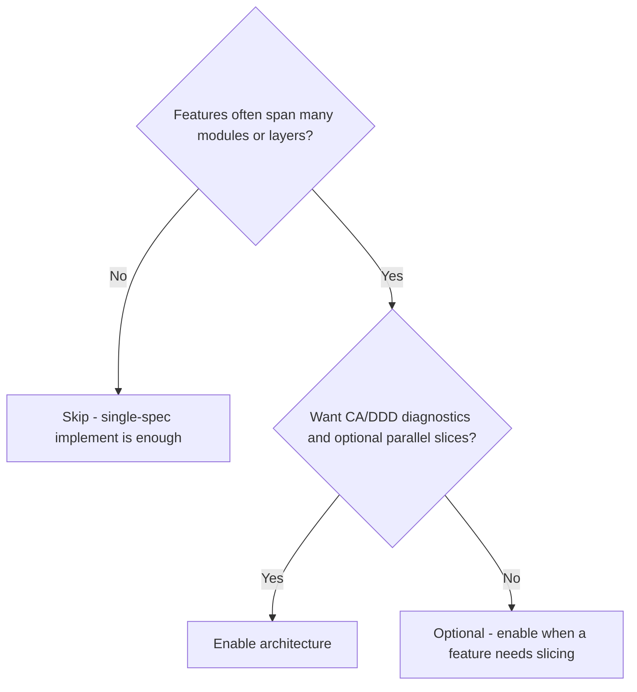
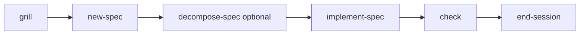

# Architecture decomposition

> Clean Architecture / DDD guided slices — optional parallel work when contracts exist.

> **Requires packs:** `spec` and `architecture`.

::: code-group

```bash [npm]
npx create-lean-agent-kit@latest . --enable-pack architecture
```

```bash [pnpm]
pnpm dlx create-lean-agent-kit@latest . --enable-pack architecture
```

```bash [yarn]
yarn dlx create-lean-agent-kit@latest . --enable-pack architecture
```

```bash [bun]
bunx create-lean-agent-kit@latest . --enable-pack architecture
```

:::

> Then copy `.leanagentkit/architecture.yml.example` → `architecture.yml`. See [Packs](/packs).

## What it is

Optional integration for **Clean Architecture** and **Domain-Driven Design**
guided spec decomposition — with parallel-safe work slices when contracts exist.

The **architecture** pack embeds reference material from [wondelai/skills](https://github.com/wondelai/skills)
(MIT) under `.agent/skills/references/`.

You still write one parent spec; decomposition adds a slices file so large work
can be ordered (and sometimes parallelized) safely.

## Do I need this pack?



- **Enable if** you decompose non-trivial specs into dependency-aware slices, want
  CA/DDD checklists, or plan parallel adapter work with contracts.
- **Skip if** features stay small (Level 1–2) or you are happy with one sequential
  `implement-spec` per feature.

## Use cases

- **Large feature** — after `new-spec`, run `decompose-spec` → `NNN-feature-slices.md`
  with DependsOn / Parallel / Contract / FilesInPlay.
- **Parallel adapters** — once contracts exist and file sets are disjoint, implement
  Phase B slices in worktrees (optional).
- **Boundary check** — architecture-aware pass during `leanagentkit-check`.
- **With git lifecycle** — each parallel slice gets its own branch; Phase C merges.

## What it adds

| Without | With architecture decomposition |
|---------|--------------------------------|
| One spec, sequential implement | Spec + optional slices file with dependency graph |
| Manual parallel planning | Parallel slices marked when CA/DDD safety rules pass |
| Ad-hoc boundaries | Embedded CA/DDD diagnostics and contract-first integration |

## How it works



```text
grill → new-spec → decompose-spec (optional) → implement-spec → check → end-session
```

1. **`leanagentkit-new-spec`** — creates `docs/specs/NNN-<feature>.md` (including
   Decisions, Implementation order, and Test plan for non-trivial specs). Handoff
   recommends **Plan implementation** before coding; Decompose remains available
   when `offer_decompose_after_spec: true`.
2. **`leanagentkit-decompose-spec`** — creates `docs/specs/NNN-<feature>-slices.md`
   - Runs CA + DDD Quick Diagnostics from embedded references
   - Builds work slices with DependsOn, Parallel, Contract, FilesInPlay
   - Links slices file from parent spec frontmatter
   - Handoff recommends Plan (or implement using slices)
3. **`leanagentkit-implement-spec`** — portable plan gate, then sequential
   (default) or parallel slices (opt-in); optional Cursor Plan mode

Skip decomposition for Level 1–2 trivial work.

## Opt in

During bootstrap, answer **Yes** to architecture decomposition (Step 3g), or:

```bash
cp .leanagentkit/architecture.yml.example .leanagentkit/architecture.yml
# edit enabled, parallel_work.* as needed
```

Then refresh `AGENTS.md §7`:

> Read `.agent/skills/leanagentkit-match-stack.md` and run steps 7–8 only.

Or re-run bootstrap Step 3f.

## When it activates

Integration is **active** when:

- `.leanagentkit/architecture.yml` exists
- `enabled: true`

Skills advertised in `AGENTS.md §7`:

- `leanagentkit-architecture` — detection contract, parallel safety rules, boundary checks
- `leanagentkit-decompose-spec` — explicit invoke after `new-spec`

## Config

`.leanagentkit/architecture.yml`:

| Field | Default | Purpose |
|-------|---------|---------|
| `enabled` | `true` | Master switch |
| `offer_decompose_after_spec` | `true` | Offer decompose after non-trivial new-spec |
| `parallel_work.enabled` | `true` | Allow parallel mode in implement-spec |
| `parallel_work.max_parallel` | `3` | Cap concurrent parallel slices |
| `parallel_work.require_contracts` | `true` | Block parallel until Integration contracts filled |
| `parallel_work.use_worktrees` | `true` | Git worktree per parallel slice |

## Parallel safety rules

Parallel slices are allowed only when **all** hold:

- Acyclic dependency graph
- Written contract per parallel slice (port, event, or API schema)
- Disjoint file sets (no two parallel slices edit the same file)
- No shared aggregate mutation across slices
- Integration slice runs last (`parallel: no`)

Domain and use_case slices are typically sequential first.

## Parallel implementation

When a slices file exists and you consent to parallel mode (requires architecture
config with `parallel_work.enabled: true`):

1. **Phase A** — foundation slices (domain, use_case)
2. **Phase B** — parallel adapter/context slices (up to `max_parallel`), each in its own worktree when `use_worktrees: true`
3. **Phase C** — integration slice merges branches, runs `leanagentkit-check`, checks off parent spec ACs

**Do not** check off parent spec acceptance criteria until Phase C completes.

### Sequential-by-slice (no parallel)

When a slices file exists but you decline parallel (or architecture config is
inactive), `implement-spec` works **one slice at a time** in DependsOn order.
This does not require `architecture.yml` for slice ordering — only parallel mode
requires the config.

### Git lifecycle + parallel slices

When both git lifecycle and parallel mode are active:

- The standard `{branch_prefix}/{spec-slug}` branch offer is **skipped** at implement start.
- Each parallel slice gets `{branch_prefix}/{spec-slug}-{slice-id}`.
- Phase C creates an integration branch and merges slice branches with `--no-ff`.
- One PR from the integration branch when the spec is done.

Worktree recipe (from `leanagentkit-git-workflow`):

```bash
git worktree add ../<repo>-<spec-slug>-<slice-id> feature/<spec-slug>-<slice-id>
```

Portable fallback: separate chat sessions per worktree. Subagents only with explicit consent.

### Merge recipe (Phase C)

```bash
git checkout -b feature/<spec-slug> [<base>]
git merge --no-ff feature/<spec-slug>-S3 -m "feat(<slug>): integrate slice S3"
# repeat for each slice branch in DependsOn order
git worktree remove ../<repo>-<spec-slug>-<slice-id>   # when done
```

## Source of truth

| Layer | Owns | Location |
|-------|------|----------|
| Spec | Problem, goal, scope, acceptance criteria, approach | `docs/specs/NNN-*.md` |
| Slices | Work packages, parallel eligibility, contracts, slice status | `docs/specs/NNN-*-slices.md` |

## Embedded references

| Path | Content |
|------|---------|
| `.agent/skills/references/clean-architecture/` | Dependency Rule, layers, boundaries, SOLID |
| `.agent/skills/references/domain-driven-design/` | Bounded contexts, aggregates, events, ACL |
| `.agent/skills/references/THIRD_PARTY.md` | Attribution |

## Troubleshooting

**Decompose not offered after new-spec**

- Confirm `.leanagentkit/architecture.yml` exists with `enabled: true`
- Confirm `offer_decompose_after_spec: true` (when `false`, Plan / Implement are
  offered for non-trivial / trivial specs — not Decompose)
- Spec may be too trivial (< 3 ACs and < 3 modules) — invoke `decompose-spec` manually if needed

**Parallel mode blocked**

- Integration contracts section empty while `require_contracts: true`
- Slice graph has cycles or overlapping FilesInPlay
- Fix slices file, then retry implement-spec

**Boundary warnings from check**

- Architecture integration adds optional CA/DDD boundary pass — citations point to embedded refs
- Fix import direction or naming; re-run `leanagentkit-check`

## See also

- Kit skill: `template/.agent/skills/leanagentkit-architecture.md`
- Kit skill: `template/.agent/skills/leanagentkit-decompose-spec.md`
- Slices template: `template/docs/specs/_SLICES_TEMPLATE.md`
- [Git lifecycle integration](/git-lifecycle) — branch/commit/PR prompts (complements parallel worktrees)
