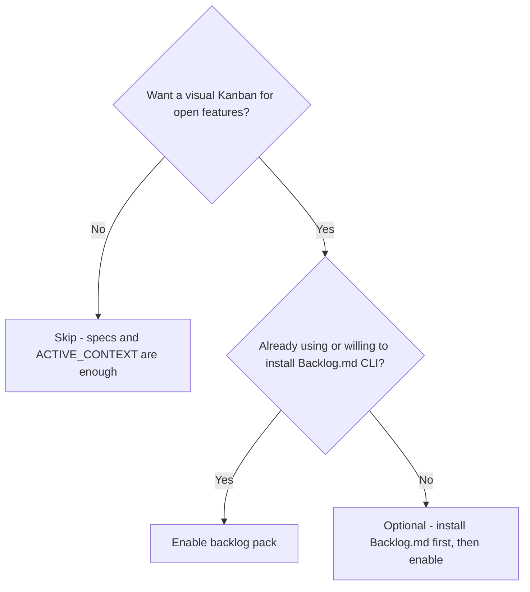
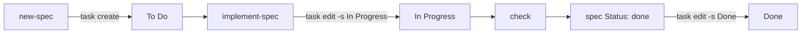

# Visual task board (Backlog.md)

> See open work on a Kanban board while specs stay the source of truth.

> **Requires packs:** `spec` and `backlog`. (`spec` is pulled in automatically.) See [Packs](/packs).

::: code-group

```bash [npm]
npx create-lean-agent-kit@latest . --enable-pack backlog
```

```bash [pnpm]
pnpm dlx create-lean-agent-kit@latest . --enable-pack backlog
```

```bash [yarn]
yarn dlx create-lean-agent-kit@latest . --enable-pack backlog
```

```bash [bun]
bunx create-lean-agent-kit@latest . --enable-pack backlog
```

:::

## What it is

Lean Agent Kit tracks work in Markdown — `docs/specs/`, `ACTIVE_CONTEXT`, `PROGRESS`.
That keeps the agent's context lean, but there is no built-in Kanban or web UI.

[Backlog.md](https://github.com/MrLesk/Backlog.md) fills that gap as an **optional**
integration: a Markdown-native task manager with a terminal board and browser UI,
synced to your kit specs through the `leanagentkit-backlog` skill.

The scaffolder (`npm create lean-agent-kit`) does **not** install Backlog.md.
You install it yourself (or let the agent guide you during bootstrap).

The **spec remains the source of truth** for problem, scope, and acceptance
criteria. The Backlog card is the **status layer** — column, checkboxes, notes.

## Do I need this pack?



- **Enable if** you want `backlog board` / browser UI synced to specs, and you (or
  your team) will keep the Backlog CLI installed.
- **Skip if** Markdown specs + `PROGRESS.md` are enough visualization — zero
  impact without the pack and without a Backlog project.

## Use cases

- **Team standup** — open `backlog board` or the browser UI; cards mirror To Do /
  In Progress / Done without leaving Markdown.
- **Spec ↔ card link** — `new-spec` creates a card with `--ref` to the spec;
  implement/end-session move status only when the work is real.
- **Session priming** — `start-session` lists open Backlog cards so you resume the
  right feature.
- **Trevor UX** — optional [Trevor](/trevor) wrapper for board commands without
  changing Done rules.

## Why integrate?

| Without Backlog.md | With Backlog.md |
|--------------------|-----------------|
| Specs + memory files only | Same specs + visual Kanban |
| Progress in `PROGRESS.md` | Cards move on the board as work advances |
| Agent reads `ACTIVE_CONTEXT` | You see open tasks at a glance (`backlog board`) |

## Install

Install the global CLI with your package manager of choice:

::: code-group

```bash [npm]
npm i -g backlog.md
```

```bash [pnpm]
pnpm add -g backlog.md
```

```bash [yarn]
yarn global add backlog.md
```

```bash [bun]
bun add -g backlog.md
```

```bash [brew]
brew install backlog-md
```

:::

Then initialize in your project root:

```bash
backlog init "My Project"

# No Git repo? Filesystem-only mode
backlog init "My Project" --no-git
```

During `backlog init`, when asked about AI integration, choose **Skip** — Lean
Agent Kit owns `AGENTS.md`. Do **not** run `backlog agents --update-instructions`.

## Enable in Lean Agent Kit

1. Scaffold or upgrade the kit in your project.
2. Run bootstrap and answer **Yes** to the Backlog.md offer (Step 3b), **or** say:
   > Read `.agent/skills/leanagentkit-backlog.md` and follow it.
3. `leanagentkit-match-stack` detects Backlog and advertises the skill in
   `AGENTS.md §7`.

Integration is **active** only when both are true:

- `backlog` is on your PATH
- A Backlog project exists (`backlog/`, `.backlog/`, or `backlog.config.yml`)

Otherwise lifecycle skills skip Backlog steps silently — zero impact.

## How it maps to the daily loop

```
leanagentkit-start-session  →  lists open Backlog cards (To Do / In Progress)
leanagentkit-new-spec       →  creates card linked to spec (--ref docs/specs/…)
leanagentkit-implement-spec →  moves card to In Progress; checks ACs as you go
leanagentkit-check          →  reports linked Backlog card id (non-blocking)
leanagentkit-end-session    →  Done only when spec Status: done
```



### Linking spec and card

When `new-spec` creates a Backlog card, the returned task id is stored in the
spec frontmatter:

```markdown
> Backlog: BACK-12   ·   Status: active   ·   Updated: 2026-07-02
```

The card references the spec via `--ref docs/specs/NNN-feature.md`.

### No false "Done"

A card moves to **Done** only when:

- All acceptance criteria in the spec are checked, and
- `leanagentkit-check` passes, and
- The spec is `Status: done`

Ending a session alone does **not** complete a card. Incomplete work gets
`--append-notes` only.

## Human visualization

```bash
backlog board      # terminal Kanban
backlog browser    # web UI (default http://localhost:6420)
backlog overview   # project statistics
```

## Optional MCP (Cursor / Claude Code)

CLI is the portable baseline for all agents. For Cursor or Claude Code you may
add the Backlog MCP server — see `.agent/skills/leanagentkit-backlog.md` for
setup. Same status rules apply regardless of CLI vs MCP.

## Further reading

- [Backlog.md repository](https://github.com/MrLesk/Backlog.md)
- Kit skill: `template/.agent/skills/leanagentkit-backlog.md` (in your project:
  `.agent/skills/leanagentkit-backlog.md`)
- [Trevor assistant](/trevor) — optional Backlog UX wrapper via `leanagentkit-ask-trevor`
- [Full guide](/guide) — daily loop section includes Backlog.md overview
