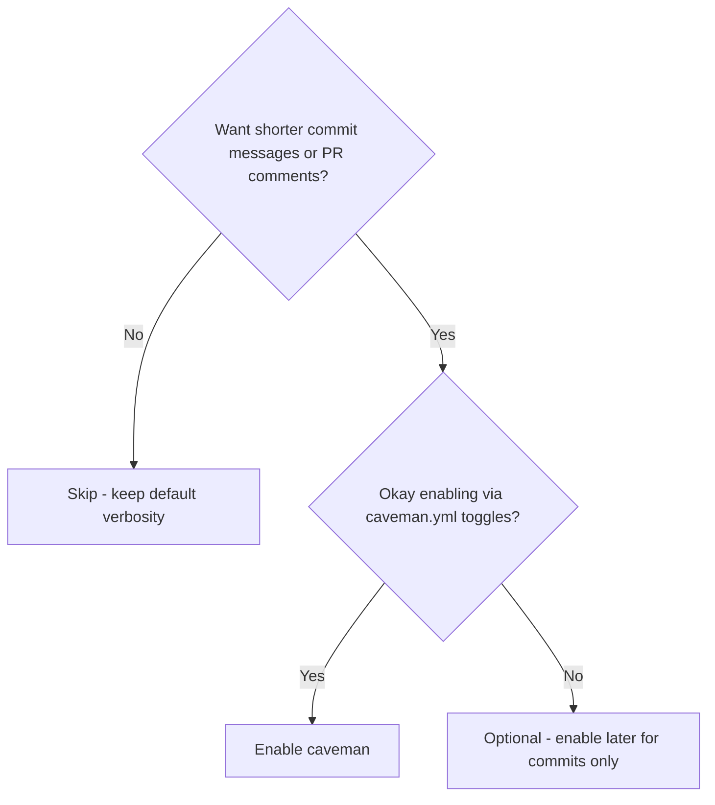
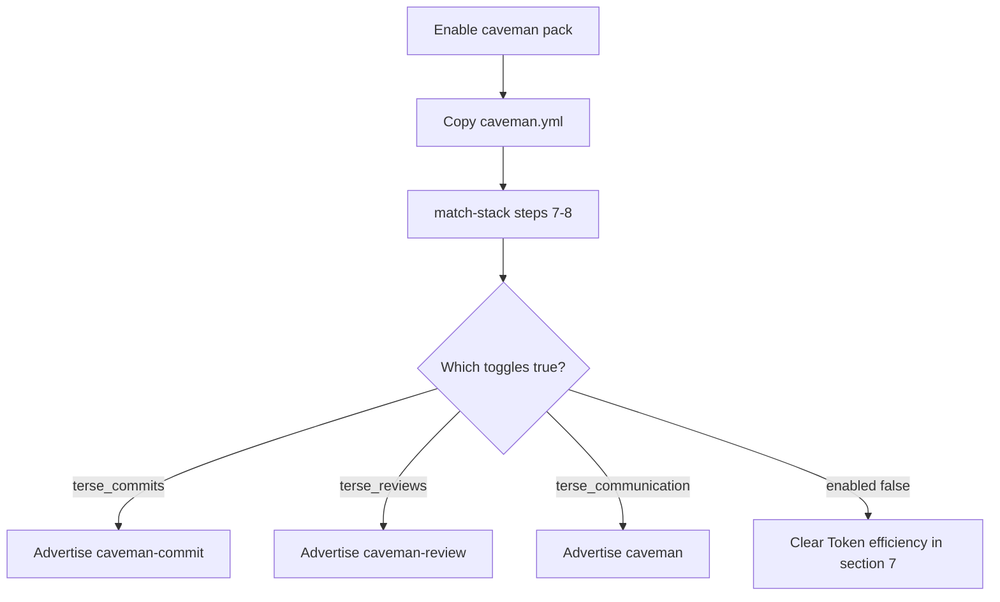

# Caveman — token-efficiency skills

> Terse commits, PR comments, and optional short chat replies — without compressing kit memory.

> **Requires pack:** `caveman`. Skills are not on disk until the pack is enabled. See [Packs](/packs).

::: code-group

```bash [npm]
npx create-lean-agent-kit@latest . --enable-pack caveman
```

```bash [pnpm]
pnpm dlx create-lean-agent-kit@latest . --enable-pack caveman
```

```bash [yarn]
yarn dlx create-lean-agent-kit@latest . --enable-pack caveman
```

```bash [bun]
bunx create-lean-agent-kit@latest . --enable-pack caveman
```

:::

## What it is

Optional **terse output** skills adapted from [Caveman](https://github.com/JuliusBrussee/caveman)
(MIT) by Julius Brussee. They shrink how the agent **writes** — commit messages, PR comments,
and (optionally) chat replies — without compressing kit memory files.

Caveman is a **thin style layer** — it does not replace `leanagentkit-review`,
`leanagentkit-git-workflow`, ambient memory / `LEARNINGS.md`, or the memory protocol.

## Do I need this pack?



- **Enable if** you want terse Conventional Commits and/or one-line PR review
  comments (and optionally terse chat).
- **Skip if** long explanatory replies help you, or you already keep commits short
  without a skill — terse chat can be net-negative on short Q&A.

## Use cases

- **Commit formatting** — pair `leanagentkit-git-workflow` (discipline) with
  `leanagentkit-caveman-commit` (short message style).
- **PR thread comments** — `leanagentkit-caveman-review` for paste-ready one-liners
  after a full `leanagentkit-review`.
- **Long architecture chats** — turn on `terse_communication` only when replies
  tend to ramble.
- **Team default** — commit `caveman.yml` so everyone shares the same toggles.

## What Caveman is / is not

| Caveman is                                   | Caveman is not                                                          |
| -------------------------------------------- | ----------------------------------------------------------------------- |
| Terse Conventional Commit message formatting | A replacement for `leanagentkit-git-workflow` principles                |
| One-line paste-ready PR review comments      | A replacement for multi-axis `leanagentkit-review`                      |
| Optional terse agent chat replies            | Memory compression for `CODEBASE_MAP`, `ACTIVE_CONTEXT`, or `LEARNINGS` |
| Opt-in via `.leanagentkit/caveman.yml`       | Always-on guardrails                                                    |

## How it works



## Quick start

1. Copy the config example:

   ```bash
   cp .leanagentkit/caveman.yml.example .leanagentkit/caveman.yml
   ```

2. Adjust toggles (defaults: commits and reviews on, terse replies off).

3. Re-run stack matching so `AGENTS.md §7` lists enabled skills:

   > Read `.agent/skills/leanagentkit-match-stack.md` and follow it.

   Or enable during bootstrap — Step 3e offers Caveman setup.

## Config

`.leanagentkit/caveman.yml`:

```yaml
enabled: true
terse_communication: false # leanagentkit-caveman — off by default
terse_commits: true # leanagentkit-caveman-commit
terse_reviews: true # leanagentkit-caveman-review
```

| Toggle                | Skill                         | Default | Notes                                      |
| --------------------- | ----------------------------- | ------- | ------------------------------------------ |
| `terse_communication` | `leanagentkit-caveman`        | `false` | Adds ~1–1.5k input tokens/turn when active |
| `terse_commits`       | `leanagentkit-caveman-commit` | `true`  | Pairs with `leanagentkit-git-workflow`     |
| `terse_reviews`       | `leanagentkit-caveman-review` | `true`  | Pairs with `leanagentkit-review`           |

Integration is **active** only when `.leanagentkit/caveman.yml` exists with `enabled: true`.
Otherwise skills remain available for explicit invoke — zero impact on the daily loop.

## Pairing with LAK skills

```
leanagentkit-git-workflow     →  commit principles, atomicity, branch discipline
leanagentkit-caveman-commit   →  terse message formatting only

leanagentkit-review           →  five-axis findings report before merge
leanagentkit-caveman-review   →  one-line PR thread comments

leanagentkit-handoff          →  clear prose in HANDOFF.md (not terse)
docs/memory/LEARNINGS.md      →  clear prose for project learnings (not terse)
leanagentkit-caveman          →  terse chat replies only when enabled
```

Invoke any skill explicitly:

> Read `.agent/skills/leanagentkit-caveman-commit.md` and follow it.

## When it helps vs hurts

**Helps:**

- Long explanatory agent replies (architecture, debugging walkthroughs)
- Formatting commit messages and PR comments where brevity is the goal

**Hurts (net-negative):**

- Already-terse coding Q&A — skill overhead can exceed output savings
- Compressing kit memory files — use LAK's lean map + distill loop instead

See [Caveman honest numbers](https://github.com/JuliusBrussee/caveman/blob/main/docs/HONEST-NUMBERS.md)
for measured trade-offs.

## Out of scope in Lean Agent Kit

The upstream Caveman repo also ships `caveman-compress` (memory file rewriting),
hooks, stats, subagents, and MCP middleware. LAK does **not** bundle those — kit
memory stays human-readable by design.

## Attribution

Adapted from [Caveman](https://github.com/JuliusBrussee/caveman) (MIT) by **Julius Brussee**.
