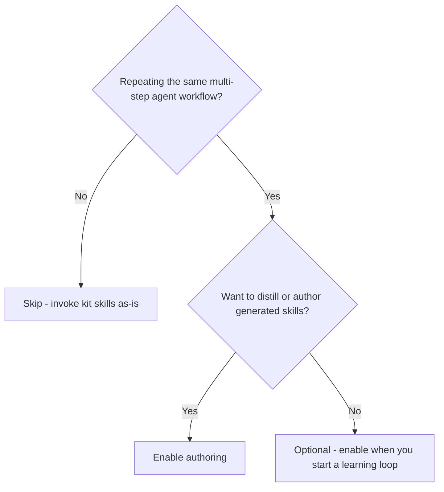
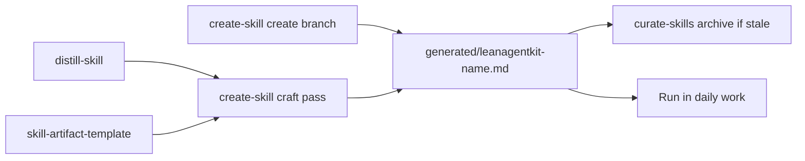

# Create skill — authoring & refactor craft

> Create and refine project-specific skills under `.agent/skills/generated/`.

> **Requires pack:** `authoring`. See [Packs](/packs).

::: code-group

```bash [npm]
npx create-lean-agent-kit@latest . --enable-pack authoring
```

```bash [pnpm]
pnpm dlx create-lean-agent-kit@latest . --enable-pack authoring
```

```bash [yarn]
yarn dlx create-lean-agent-kit@latest . --enable-pack authoring
```

```bash [bun]
bunx create-lean-agent-kit@latest . --enable-pack authoring
```

:::

## What it is

Meta skills for **creating and refactoring** project-specific skills under
`.agent/skills/generated/`. Adapted from [Matt Pocock's
`writing-great-skills`](https://github.com/mattpocock/skills/tree/main/skills/productivity/writing-great-skills)
(MIT) and Cursor `create-skill` discovery patterns. The pack applies LAK format rules
plus predictability craft — without replacing distill, artifact generators, or curation.

Use it when a repeated workflow should become a reusable, LAK-compliant skill file.

## Do I need this pack?



- **Enable if** you distill session workflows into skills, build artifact generators,
  or need a craft/refactor pass on generated skills.
- **Skip if** you only use shipped kit skills and do not maintain
  `.agent/skills/generated/`.

## Use cases

- **Distill a session** — capture a workflow with `distill-skill`, then craft-pass
  with `create-skill`.
- **Generator from an example** — `skill-artifact-template` → craft pass → run the
  generator in daily work.
- **Fix sprawl** — refactor a generated skill that duplicates steps or lacks
  completion criteria.
- **Curate** — archive stale generators without deleting history.

## What it is / is not

| Create skill is                                      | Create skill is not                                          |
| ---------------------------------------------------- | ------------------------------------------------------------ |
| Orchestrator for LAK-compliant skill authoring       | A replacement for `leanagentkit-distill-skill`               |
| Refactor lens (pruning, hierarchy, failure modes)    | A replacement for `leanagentkit-skill-artifact-template`     |
| Craft pass after distill or artifact-template drafts | Registry maintenance — use `leanagentkit-curate-skills`      |
| Explicit-invoke meta skill                           | A modifier of kit-owned `leanagentkit-*.md` in user projects |

## How it works



## Quick start

Create or refactor a generated skill:

> Read `.agent/skills/leanagentkit-create-skill.md` and follow it.

Refactor an existing file:

> Read `.agent/skills/leanagentkit-create-skill.md` and refactor
> `.agent/skills/generated/leanagentkit-<name>.md`.

## When to use which skill

| Goal                                   | Skill                                                                |
| -------------------------------------- | -------------------------------------------------------------------- |
| Session workflow → reusable skill      | `leanagentkit-distill-skill` → craft pass via create-skill           |
| Code example → artifact generator      | `leanagentkit-skill-artifact-template` → craft pass via create-skill |
| Requirements → new skill (greenfield)  | `leanagentkit-create-skill` (create branch)                          |
| Fix sprawl, duplication, skipped steps | `leanagentkit-create-skill` (refactor branch)                        |
| Archive stale generators               | `leanagentkit-curate-skills`                                         |

## References (read with create-skill)

| File                                      | Role                                                                |
| ----------------------------------------- | ------------------------------------------------------------------- |
| `references/skill-authoring-standards.md` | Frontmatter, WHAT+WHEN descriptions, section order, output paths    |
| `references/skill-craft-glossary.md`      | Predictability, information hierarchy, failure modes, LAK overrides |

## LAK hard rules vs craft principles

**Hard rules (always):**

- Generated skills live at `.agent/skills/generated/leanagentkit-<name>.md`
- `description` — third person, **WHAT + WHEN**, trigger terms; soft target **≤200** chars; hard max **1024**
- Never delete — archive to `generated/archived/` with `status: archived`
- Never modify kit-owned `leanagentkit-*.md` in user projects (overwritten on upgrade)
- No router/index-only skills

**Craft principles (refactor levers):**

- **Predictability** — same process every run, not identical output
- **Completion criteria** — checkable, exhaustive where it matters
- **Progressive disclosure** — push reference to sibling files with sharp pointers
- **Leading words** — collapse verbose triads into pretrained tokens
- **Failure modes** — premature completion, duplication, sediment, sprawl, no-op

Cursor and agentskills allow richer discovery descriptions; LAK generated skills
should stay concise unless extra trigger terms materially improve routing.

## Pairing with the learning loop

```
leanagentkit-distill-skill          →  capture session workflow
leanagentkit-skill-artifact-template →  infer generator from example
leanagentkit-create-skill           →  standards + craft pass
leanagentkit-curate-skills          →  archive stale; never delete
generated/leanagentkit-<name>.md      →  run the skill in daily work
```

## Invocation examples

**New skill from requirements:**

> Read `.agent/skills/leanagentkit-create-skill.md` and follow it. I need a skill for …

**Craft pass on a distill draft:**

> Read `.agent/skills/leanagentkit-create-skill.md` — craft pass only on
> `.agent/skills/generated/leanagentkit-<name>.md`.
