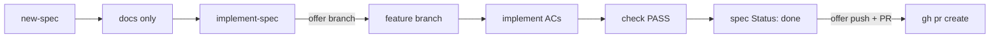

# Git lifecycle integration

Lean Agent Kit tracks work in Markdown — `docs/specs/`, `ACTIVE_CONTEXT`, `PROGRESS`.
Git operations (branch, commit, PR) are **not** forced on the daily loop. For teams
that want prompt-based git at natural lifecycle boundaries, the kit offers an
**optional** integration through the `leanagentkit-git-lifecycle` skill.

The scaffolder (`npm create lean-agent-kit`) does **not** create git lifecycle config.
You opt in during bootstrap (Step 3c) or copy the example config manually.

## Why integrate?

| Without git lifecycle | With git lifecycle |
|---------------------|-------------------|
| Spec + memory only; you manage git yourself | Same spec workflow + offers at implement/end/done |
| Branch whenever you remember | Branch offer at `implement-spec` start |
| Manual PR when feature ships | Push + PR offer when spec is `done` and check passes |

The **spec remains the source of truth** for problem, scope, and acceptance
criteria. The **git branch** is the **execution sandbox** — recorded in spec
frontmatter when created.

## Enable in Lean Agent Kit

1. Scaffold or upgrade the kit in a **git repository** (`.git` exists).
2. Run bootstrap and answer **Yes** to the git lifecycle offer (Step 3c), **or** say:
   > Read `.agent/skills/leanagentkit-git-lifecycle.md` and follow it.
3. Bootstrap copies `.leanagentkit/git-lifecycle.yml.example` →
   `.leanagentkit/git-lifecycle.yml`. Commit the config so teammates share settings.
4. `leanagentkit-match-stack` detects the config and advertises the skill in
   `AGENTS.md §7`.

Integration is **active** only when **both** are true:

- `.git` exists
- `.leanagentkit/git-lifecycle.yml` exists

Otherwise lifecycle skills skip git lifecycle steps silently — zero impact.

## Config

`.leanagentkit/git-lifecycle.yml`:

```yaml
enabled: true
branch_prefix: feature          # feature | fix | chore | refactor
default_base: main
offer_commit_on_ac: false       # off by default (noisy)
offer_commit_at_end_session: true
offer_pr_when_spec_done: true   # requires gh on PATH
offer_babysit_after_pr: false  # offer merge-ready loop after PR is opened
```

## How it maps to the daily loop

```
leanagentkit-new-spec       →  no git hooks (docs only)
leanagentkit-implement-spec →  offer branch at start; optional commit per AC; offer PR when done
leanagentkit-end-session    →  offer save-point commit if working tree is dirty
```



### Linking spec and branch

When the user accepts a branch offer at `implement-spec` start, the branch name
is recorded in the spec frontmatter:

```markdown
> Branch: feature/team-workspaces   ·   Backlog: BACK-12   ·   Status: active   ·   Updated: 2026-07-02
```

Branch slug from filename: `005-team-workspaces.md` → `team-workspaces`.

### Prompt-only — never automatic

Every git operation requires explicit user confirmation:

- No auto-commit, auto-push, or auto-PR
- Declining a prompt continues the lifecycle skill normally
- PR offers require GitHub CLI (`gh`) on PATH; skipped silently if missing

## GitHub CLI (for PR offers)

```bash
# Install gh, then authenticate
gh auth login
```

Without `gh`, branch and commit offers still work; only the PR step is skipped.

## PR babysit (optional)

When `offer_babysit_after_pr: true` in `.leanagentkit/git-lifecycle.yml`, the
lifecycle skill offers to run `leanagentkit-babysit-pr` after a PR is created.
That skill triages review comments, resolves merge conflicts, and fixes in-scope
CI failures in a loop until the PR is merge-ready — without auto-merging or
weakening CI.

Enable during bootstrap (Step 3c follow-up) or set the flag manually, then
re-run `leanagentkit-match-stack` so `AGENTS.md §7` advertises the skill.

## Principles

Branch naming, atomic commits, and save-point patterns follow
`leanagentkit-git-workflow` — the lifecycle skill handles prompts and commands;
git-workflow holds the discipline.

## Further reading

- Kit skill: `template/.agent/skills/leanagentkit-git-lifecycle.md` (in your project:
  `.agent/skills/leanagentkit-git-lifecycle.md`)
- [Full guide](/guide) — daily loop section includes git lifecycle overview
- [Backlog.md integration](/backlog) — optional status layer (complements git lifecycle)
