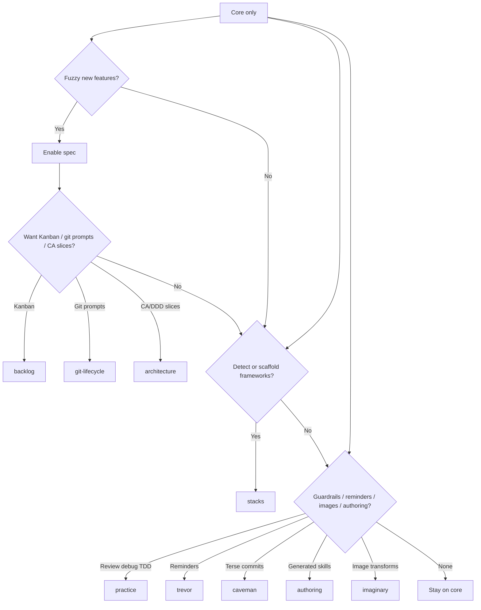

# Packs

Optional overlays shipped in the same npm package. **Not** copied on a default
core install.

Not sure which packs you need? Each pack page starts with a **Do I need this
pack?** flowchart — start with [Spec](/spec) and [Stacks](/stacks) if you are
new, then add integrations only when you feel the gap.



## Install

::: code-group

```bash [npm]
# First scaffold
npx create-lean-agent-kit@latest . --with spec,stacks

# Existing install
npx create-lean-agent-kit@latest . --enable-pack practice,caveman

# Agent skill
# Read .agent/skills/leanagentkit-enable-pack.md and follow it.
```

```bash [pnpm]
# First scaffold
pnpm dlx create-lean-agent-kit@latest . --with spec,stacks

# Existing install
pnpm dlx create-lean-agent-kit@latest . --enable-pack practice,caveman

# Agent skill
# Read .agent/skills/leanagentkit-enable-pack.md and follow it.
```

```bash [yarn]
# First scaffold
yarn dlx create-lean-agent-kit@latest . --with spec,stacks

# Existing install
yarn dlx create-lean-agent-kit@latest . --enable-pack practice,caveman

# Agent skill
# Read .agent/skills/leanagentkit-enable-pack.md and follow it.
```

```bash [bun]
# First scaffold
bunx create-lean-agent-kit@latest . --with spec,stacks

# Existing install
bunx create-lean-agent-kit@latest . --enable-pack practice,caveman

# Agent skill
# Read .agent/skills/leanagentkit-enable-pack.md and follow it.
```

:::

Dependencies are resolved automatically (`architecture`, `backlog`, and
`git-lifecycle` pull in `spec`).

## Catalog

| Id              | Depends | Docs                                        |
| --------------- | ------- | ------------------------------------------- |
| `spec`          | —       | [Spec](/spec)                               |
| `stacks`        | —       | [Stacks](/stacks)                           |
| `practice`      | —       | [Practice](/practice)                       |
| `architecture`  | `spec`  | [Architecture](/architecture-decomposition) |
| `backlog`       | `spec`  | [Backlog.md](/backlog)                      |
| `git-lifecycle` | `spec`  | [Git lifecycle](/git-lifecycle)             |
| `trevor`        | —       | [Trevor](/trevor)                           |
| `caveman`       | —       | [Caveman](/caveman)                         |
| `authoring`     | —       | [Create skill](/create-skill)               |
| `imaginary`     | —       | [Imaginary](/imaginary)                     |

Installed packs are recorded in `.agent/.leanagentkit-version` → `installedPacks`.

## Prune

::: code-group

```bash [npm]
npx create-lean-agent-kit@latest . --prune-to-core
npx create-lean-agent-kit@latest . --prune-to-core --keep-pack spec,stacks
```

```bash [pnpm]
pnpm dlx create-lean-agent-kit@latest . --prune-to-core
pnpm dlx create-lean-agent-kit@latest . --prune-to-core --keep-pack spec,stacks
```

```bash [yarn]
yarn dlx create-lean-agent-kit@latest . --prune-to-core
yarn dlx create-lean-agent-kit@latest . --prune-to-core --keep-pack spec,stacks
```

```bash [bun]
bunx create-lean-agent-kit@latest . --prune-to-core
bunx create-lean-agent-kit@latest . --prune-to-core --keep-pack spec,stacks
```

:::

Pack files are moved to `.leanagentkit-backup/<timestamp>-prune/`, not deleted
forever. That can include pack memory such as `PROGRESS.md` / reminders when
those packs are removed; core `ACTIVE_CONTEXT` and `LEARNINGS` stay. User-authored specs under
`docs/specs/` are left in place. After prune, **review `AGENTS.md` §7** — it is
preserved and may still list removed packs.

Dependencies are **auto-installed** (e.g. `--enable-pack backlog` also installs
`spec`). Re-enable packs with `--enable-pack`.

## practice

See the dedicated [Practice](/practice) page for guardrail skills (review, debug,
TDD, security, …), always-on vs conditional detection, and whether you need the
pack.
