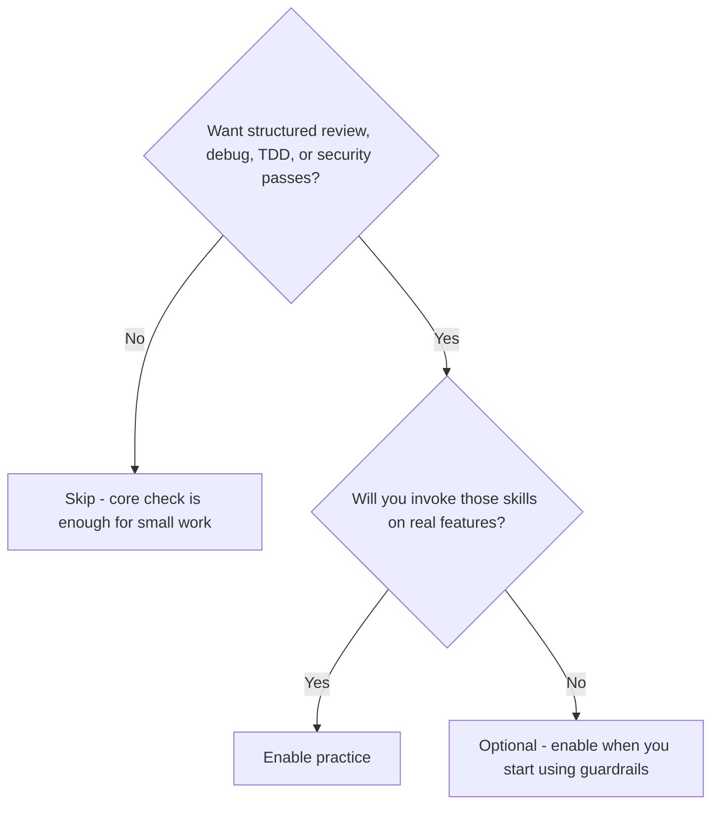
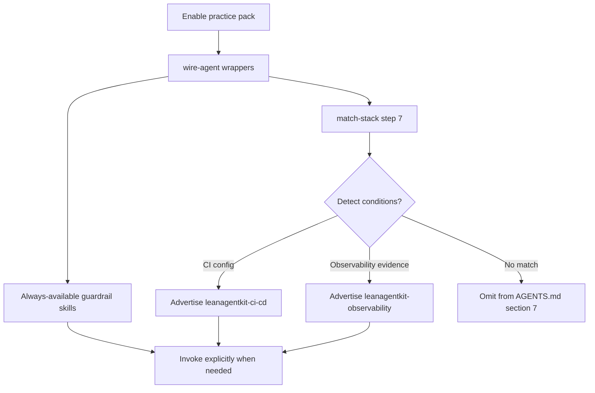

# Practice — engineering guardrails

> Review, debug, TDD, security, performance, and related skills — on disk only after you enable the pack.

> **Requires pack:** `practice`. See [Packs](/packs).

::: code-group

```bash [npm]
npx create-lean-agent-kit@latest . --enable-pack practice
```

```bash [pnpm]
pnpm dlx create-lean-agent-kit@latest . --enable-pack practice
```

```bash [yarn]
yarn dlx create-lean-agent-kit@latest . --enable-pack practice
```

```bash [bun]
bunx create-lean-agent-kit@latest . --enable-pack practice
```

:::

## What it is

The **practice** pack adds engineering guardrail skills so the agent can run a
structured review, debug systematically, follow TDD, and check security /
performance / API design — without stuffing those skills into every core install.

After enable + `leanagentkit-wire-agent`, skills live under `.agent/skills/`. Some
are always available to invoke; a few **conditional** ones (CI/CD, observability)
are advertised in `AGENTS.md` §7 only when the repo shows matching evidence
(usually via `leanagentkit-match-stack` step 7).

## Do I need this pack?



- **Enable if** you want `leanagentkit-review`, `debug`, `tdd`, `security`,
  `performance`, `git-workflow`, and related skills available in the project.
- **Skip if** you only need map + ambient memory + LEARNINGS + convention check —
  core already includes `leanagentkit-check`.

## Use cases

- **Pre-merge review** — run `leanagentkit-review` for a multi-axis findings report
  before opening a PR.
- **Hard bug** — `leanagentkit-debug` forces evidence-first diagnosis instead of
  shotgun edits.
- **New behavior** — `leanagentkit-tdd` keeps red → green → refactor discipline.
- **Threat / perf pass** — `security` / `performance` with checklists under
  `.agent/skills/references/`.
- **Repo with CI** — after match-stack, `leanagentkit-ci-cd` appears in §7 when CI
  config is detected.

## How it works



### Skills in this pack

| Skill                          | Typical use                                       |
| ------------------------------ | ------------------------------------------------- |
| `leanagentkit-review`          | Multi-axis review before merge                    |
| `leanagentkit-simplify`        | Reduce complexity after a feature lands           |
| `leanagentkit-git-workflow`    | Branch / commit discipline                        |
| `leanagentkit-docs`            | Documentation updates                             |
| `leanagentkit-debug`           | Evidence-first debugging                          |
| `leanagentkit-tdd`             | Test-driven implementation                        |
| `leanagentkit-security`        | Security checklist pass                           |
| `leanagentkit-performance`     | Performance checklist pass                        |
| `leanagentkit-deprecation`     | Safe deprecation plans                            |
| `leanagentkit-api-design`      | API shape review                                  |
| `leanagentkit-frontend-design` | UI/frontend craft checklist                       |
| `leanagentkit-ci-cd`           | Conditional — when CI config exists               |
| `leanagentkit-observability`   | Conditional — when observability evidence matches |

Registry of practice skills (always-on vs conditional):
`.agent/practice-skills/registry.md` after the pack is installed.

Invoke any skill explicitly:

> Read `.agent/skills/leanagentkit-review.md` and follow it.

## Further reading

- [Packs](/packs) — enable / prune
- [Stacks](/stacks) — match-stack advertises conditional practice skills in §7
- [Caveman](/caveman) — optional terse formatting paired with review / git-workflow
- [Getting started](/getting-started)
