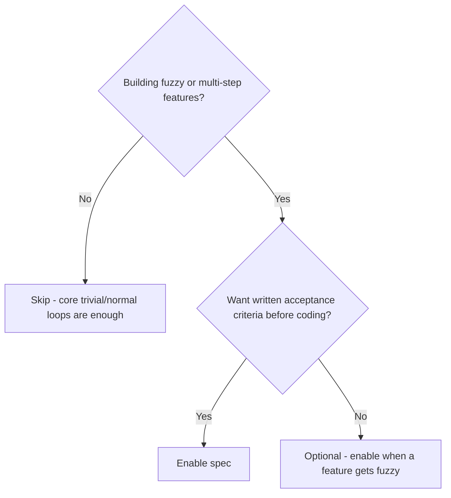
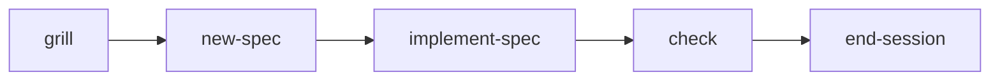

# Spec workflow

> Spec-driven features: grill the idea, write a spec, implement against acceptance criteria.

> **Requires pack:** `spec`. Skills are not on disk until the pack is enabled. See [Packs](/packs).

::: code-group

```bash [npm]
npx create-lean-agent-kit@latest . --enable-pack spec
```

```bash [pnpm]
pnpm dlx create-lean-agent-kit@latest . --enable-pack spec
```

```bash [yarn]
yarn dlx create-lean-agent-kit@latest . --enable-pack spec
```

```bash [bun]
bunx create-lean-agent-kit@latest . --enable-pack spec
```

:::

## What it is

The **spec** pack adds a structured loop for non-trivial features. Instead of
coding from a vague chat request, the agent grills unclear requirements, writes a
Markdown spec with acceptance criteria, then implements against that spec and
checks the result.

Core Lean Agent Kit already handles map + session memory. Spec is the pack you
enable when “just start coding” is too risky.

## Do I need this pack?



- **Enable if** you ship new features regularly, want grill → spec → implement, or
  you plan to use [architecture](/architecture-decomposition), [backlog](/backlog),
  or [git lifecycle](/git-lifecycle) (those packs depend on `spec`).
- **Skip if** you only do small fixes and Q&A — core’s trivial/normal workflow
  sizes are enough.

## Use cases

- **New product feature** — “Add team workspaces” is fuzzy; grill clears scope,
  `new-spec` writes `docs/specs/00N-….md`, `implement-spec` works AC by AC.
- **Risky change** — auth, payments, migrations; a written spec is the shared
  contract for the agent and humans.
- **Handoff mid-feature** — next session reads the active spec + `ACTIVE_CONTEXT`
  instead of rediscovering the plan.
- **Foundation for other packs** — Backlog cards, git branch/PR offers, and
  architecture slices all hang off specs.

## How it works



| Skill | Role |
|-------|------|
| `leanagentkit-grill` | Ask clarifying questions until the problem is sharp |
| `leanagentkit-new-spec` | Create `docs/specs/NNN-feature.md` from the template |
| `leanagentkit-implement-spec` | Implement acceptance criteria; update progress |
| `leanagentkit-spike` | Time-boxed exploration when the approach is unknown |
| `leanagentkit-seed-adrs` | Capture architecture decisions into `docs/adr/` |

Also ships memory files used by the substantial loop: `docs/memory/PROGRESS.md`,
`docs/memory/SCRATCH.md`, and templates under `docs/specs/` / `docs/adr/`.

### Workflow size reminder

| Size | When | Loop |
|------|------|------|
| Trivial | Typo, rename, Q&A | Just do it (no spec pack needed) |
| Normal | Typical coding | `start-session` → work → `check` → `end-session` |
| Substantial | Fuzzy/new feature | **This pack:** grill → new-spec → implement-spec → check → end-session |

## Further reading

- [Full guide](/guide) — substantial work section
- [Architecture decomposition](/architecture-decomposition) — optional slices after `new-spec`
- [Backlog.md](/backlog) — visual status layer on top of specs
- [Git lifecycle](/git-lifecycle) — branch / commit / PR offers tied to specs
