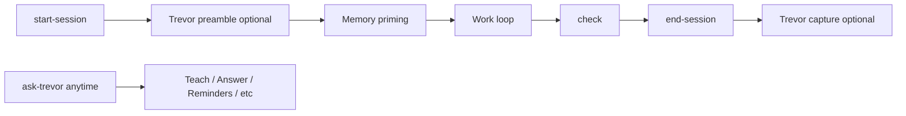

# Trevor — kit concierge

Trevor is Lean Agent Kit's optional **concierge assistant**: teach how to use the
kit, answer from memory, manage personal reminders and checklists, wrap Backlog UX,
run workflows, and suggest what to do next.

Trevor is a **thin orchestrator** — it routes to existing skills; it does not
replace `start-session`, specs, or the Backlog integration rules.

## What Trevor is / is not

| Trevor is | Trevor is not |
|-----------|---------------|
| A friendly entry point for kit questions | A replacement for `leanagentkit-start-session` |
| Personal reminders and checklists | Project blockers (use `ACTIVE_CONTEXT`) |
| Backlog UX wrapper (delegates to `leanagentkit-backlog`) | A second source of spec truth |
| Optional session nudges at start/end | Mandatory process on every task |

Invoke anytime:

> Read `.agent/skills/leanagentkit-ask-trevor.md` and follow it.

Or say: **"Ask Trevor …"**

## Quick start

1. Copy the config example:

   ```bash
   cp .leanagentkit/trevor.yml.example .leanagentkit/trevor.yml
   ```

2. Set `enabled: true` in `.leanagentkit/trevor.yml`.

3. Run your normal session start:

   > Read `leanagentkit-start-session` and follow it.

   Pending reminders surface at the end of priming (when `session_preamble: true`).

4. Ask Trevor anything:

   > Ask Trevor how to start a new feature.

Or enable during bootstrap — Step 3d offers Trevor setup.

## Storage layout

All Trevor artifacts live under `docs/memory/` (user-owned, git-friendly):

| Path | Purpose |
|------|---------|
| `docs/memory/REMINDERS.md` | Personal nudges (pending / acknowledged / done) |
| `docs/memory/CHECKLISTS/*.md` | User-defined runnable checklists |
| `docs/memory/WORKFLOWS/*.md` | Multi-step personal procedures |
| `.leanagentkit/trevor.yml` | Opt-in config (not overwritten on upgrade) |

### Reminder schema

```markdown
## R-001 · Review auth spec with team
- created: 2026-07-01
- show_after: 2026-07-02
- status: pending | acknowledged | done
- acknowledged: 2026-07-02
- linked: docs/specs/002-auth.md
- backlog: BACK-12
- note: Don't forget refresh token TTL
```

IDs are monotonic (`R-001`, `R-002`, …). Entries are never deleted — mark `done`.

### Config (`.leanagentkit/trevor.yml`)

```yaml
enabled: true
session_preamble: true
max_reminders_per_session: 3
end_session_capture: true
checklist_default_mode: guided   # guided | batch
```

## Modes

| Mode | Trigger | Reads / writes |
|------|---------|----------------|
| **Teach** | how, teach, which skill | Routes to guide + kit skills |
| **Answer** | project status, where is | `ACTIVE_CONTEXT`, `CODEBASE_MAP`, linked spec |
| **Reminders** | remind, snooze, acknowledge | `REMINDERS.md` |
| **Checklists** | run checklist | `CHECKLISTS/*.md` |
| **Backlog UX** | board, move card, kanban | Delegates to `leanagentkit-backlog` |
| **What next** | what should I do | Synthesizes resume + Backlog + reminders |
| **Workflows** | run workflow | `WORKFLOWS/*.md` |

### Checklists: guided vs batch

- **Guided** — one unchecked item at a time; interactive Yes / No / Skip.
- **Batch** — list all items; user confirms which to check off.

Mode comes from checklist frontmatter, else `checklist_default_mode` in config.

**Kit checklists** (security, performance) live in `.agent/skills/references/` —
read-only audit lists for guardrail skills. **Trevor checklists** are yours under
`docs/memory/CHECKLISTS/`.

Checklists run only when you invoke Trevor (or a workflow step) — never
automatically at session start.

### Backlog UX

When Backlog.md is active (`backlog` on PATH + project initialized), Trevor can
list cards, create cards linked to specs, move status, and append notes — always
via procedures in [`leanagentkit-backlog`](/backlog). Cards move to **Done** only
when the spec is genuinely finished (same no-false-Done rule as the daily loop).

## Session hooks

### Start session

When `enabled: true` and `session_preamble: true`, `leanagentkit-start-session`
shows up to `max_reminders_per_session` pending reminders (default 3), one at a
time:

- **Acknowledge** — marks reminder acknowledged
- **Not now** — skip
- **Snooze 3 days** — sets `show_after` forward

Prefix: `[🤖 Trevor]`. Session continues normally after reminders.

### End session

When `end_session_capture: true`, `leanagentkit-end-session` asks once whether to
save a reminder for next session.

**Opt out:** set `enabled: false` or `session_preamble: false` /
`end_session_capture: false` in config.

## Relationship to the daily loop



```
leanagentkit-start-session → (Trevor reminders?) → work → check → end-session → (Trevor capture?)
```

Trevor does not change spec-driven workflow: grill → new-spec → implement-spec.

## Open work semantics

| Source | Owns |
|--------|------|
| `ACTIVE_CONTEXT` | Current project focus, blockers, resume note |
| `docs/specs/` | Feature scope and acceptance criteria |
| Backlog card | Status / Kanban visualization |
| `REMINDERS.md` | Personal nudges (not project truth) |

## Team vs personal

`REMINDERS.md` and checklists are committable — useful for team hygiene. Solo
developers may add `docs/memory/REMINDERS.md` to `.gitignore` if reminders should
stay private.

## Learning loop

Repeated Trevor workflows (e.g. weekly review) can be distilled into reusable
project skills:

> Read `leanagentkit-distill-skill` and follow it.

## Further reading

- Skill: `.agent/skills/leanagentkit-ask-trevor.md`
- [Full guide](/guide) — daily loop §4
- [Backlog.md integration](/backlog)
- Config example: `.leanagentkit/trevor.yml.example`
