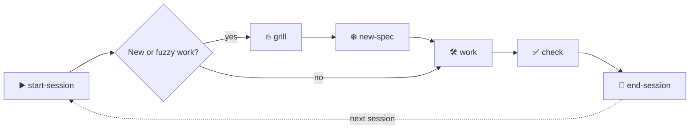

# 📚 The Full LeanAgentKit Guide

> **How to use LeanAgentKit to boost your productivity, build solid apps, and deploy with confidence.**
> From your very first `start-session` to authoring custom generators and orchestrating multiple agents in parallel — this is the end‑to‑end manual.

If the [README](./README.md) is the *pitch*, this is the *playbook*. 🏈 Read it once front to back, then keep it open as a reference.

---

## 🧭 Table of contents

1. [The mental model (read this first)](#-1-the-mental-model-read-this-first)
2. [Install & bootstrap — your first 10 minutes](#-2-install--bootstrap--your-first-10-minutes)
3. [Memory tiers — how the kit remembers](#-3-memory-tiers--how-the-kit-remembers)
4. [The daily loop — your everyday rhythm](#-4-the-daily-loop--your-everyday-rhythm)
5. [Workflows from simple to complex](#-5-workflows-from-simple-to-complex)
6. [Stacks & external skills](#-6-stacks--external-skills)
7. [Artifact generators — teach the kit to scaffold](#-7-artifact-generators--teach-the-kit-to-scaffold)
8. [Engineering‑practice guardrails](#-8-engineeringpractice-guardrails)
9. [Working across sessions, tools & teammates](#-9-working-across-sessions-tools--teammates)
10. [Pro tips & anti‑patterns](#-10-pro-tips--antipatterns)
11. [Troubleshooting & FAQ](#-11-troubleshooting--faq)
12. [The one‑page cheat sheet](#-12-the-onepage-cheat-sheet)

---

## 🧠 1. The mental model (read this first)

Before any commands, internalize **what LeanAgentKit actually is**, because everything else follows from it.

> 🪄 LeanAgentKit is a **Markdown brain** for your AI agent. It turns "a forgetful intern who re-reads your whole repo every morning" into "a senior who already knows the map, the rules, and where you left off."

It rests on three pillars:

- 🗺️ **Memory** — tiered Markdown files (`CODEBASE_MAP.md`, `ACTIVE_CONTEXT.md`, specs, ADRs…) the agent reads *instead of* re-scanning your repo. Cheap context, no drift.
- 🛡️ **Guardrails** — `AGENTS.md` conventions + stack playbooks + always‑on practice skills (review, debug, security…) that keep every change consistent with *your* standards.
- 🧩 **Skills** — 24 tool‑agnostic Markdown "skills" you invoke by saying *"Read `.agent/skills/leanagentkit-<name>.md` and follow it."* Each one is a focused, repeatable procedure.

### 🪶 The golden rule: *lean by default*

The kit only scaffolds what your project actually uses. Tiers you don't enable are never created. Stacks you don't have are never wired. This keeps your context window small and your repo clean. **When in doubt, less is more.**

### 🔌 Tool-agnostic, with native wiring

Because skills are *just files*, **any** agent that can read files works: Cursor, Claude Code, Copilot, ChatGPT, Aider, Cline. Cursor and Claude Code additionally get **native wrappers** auto‑generated so you can invoke skills as first‑class commands.

> 💡 **Story — meet Maya.** Maya inherits a 3‑year‑old SvelteKit app. Day one, every AI chat starts with "the auth lives in… uh, let me find it." After bootstrapping LeanAgentKit, her agent opens `CODEBASE_MAP.md`, sees `Auth: src/lib/server/auth.ts`, and goes straight there. No grep, no drift, no 40‑message warm‑up. We'll follow Maya throughout this guide. 👩‍💻

---

## 🚀 2. Install & bootstrap — your first 10 minutes

### Step 1 — Drop the kit into your project

```bash
# 📂 into the current directory (most common — brownfield)
npm create lean-agent-kit

# 🆕 into a new/named folder
npm create lean-agent-kit my-app

# 🔁 equivalently
npx create-lean-agent-kit .
```

This copies the *template* (files only, zero runtime deps) into your repo: `AGENTS.md`, `.agent/`, and `docs/`. Nothing runs yet — it's inert Markdown waiting for the bootstrap.

> 🚩 **Flags:** `--force` overwrites existing kit files · `--upgrade` refreshes kit files safely · `--help` shows usage.
> 📦 **No‑npm option:** `npx degit YOUR_USER/create-lean-agent-kit/template` pulls the raw template.

#### Upgrading an already-installed kit

```bash
npm create lean-agent-kit . --upgrade
```

Use `--upgrade` when a newer kit version is published. It refreshes kit-owned files (skills, stack playbooks, install templates, guide) while **preserving** your memory and setup: `AGENTS.md`, `docs/CODEBASE_MAP.md`, `docs/memory/*`, custom rows in `.agent/stacks/registry.md`, and edited ADRs.

Differing files are backed up to `.leanagentkit-backup/<timestamp>/` before overwrite. The installed version is stamped in `.agent/.leanagentkit-version`.

After upgrading, re-run:

> Read `.agent/skills/leanagentkit-wire-agent.md` and follow it.

Upgrade is additive — files removed from the kit in a newer release stay in your project. Avoid `--force` on brownfield projects; it overwrites everything including memory.

### Step 2 — Run the one‑shot bootstrap

Open your agent in the project and say:

> 🪄 **Read `.agent/skills/leanagentkit-bootstrap.md` and follow it.**

This is the **single most important command you'll ever run.** It interviews you, then orchestrates every setup skill in order. Here's exactly what happens 👇

| Phase | What the agent does | Skill under the hood |
|------|----------------------|----------------------|
| **0. Questionnaire** 🎛️ | Asks: which memory tiers? which agent tools? auto‑install stack skills? map detail level? | *(bootstrap itself)* |
| **1. Map** 🗺️ | Scans structure + entry points → writes `docs/CODEBASE_MAP.md` | `leanagentkit-map-codebase` |
| **2. Conventions** 📜 | Fills `AGENTS.md` §1–5 with **evidence‑based** rules from your real code | `leanagentkit-init-conventions` |
| **3. Stack** 🧰 | Detects tech from `registry.md`, confirms with you, installs matched skills, applies playbooks | `leanagentkit-match-stack` |
| **4. Wire agents** 🔌 | Generates native config + skill wrappers for Cursor/Claude (one‑line pointers for others) | `leanagentkit-wire-agent` |
| **5. Seed ADRs** 🏛️ | *(Optional, asks)* reverse‑engineers existing decisions into `docs/adr/*` | `leanagentkit-seed-adrs` |
| **5b. Generators** 🏭 | *(Optional, asks)* authors artifact generators (page, component…) | `leanagentkit-skill-artifact-template` |
| **6–8. Finish** ✅ | Documents installed stack skills, summarizes, stamps today's date | *(bootstrap)* |

### Step 3 — Answer the questionnaire thoughtfully

The four questions shape your whole experience:

1. **Memory tiers** — *Long* (map + conventions + ADRs) is recommended always on. Add *Medium* (specs + active context + progress) for any project you'll work on across multiple sessions. Add *Short* (scratchpad) for complex multi‑step tasks. Tiny throwaway? Long only.
2. **Agent targets** — pick every tool you'll actually use. Cursor & Claude get native wiring; others get a thin "Follow AGENTS.md" pointer.
3. **Stack install** — `Yes, install` if you're comfortable letting the agent run `npx skills add`; `Just list commands` if you prefer to run them yourself; `Skip` to defer.
4. **Map detail** — `Minimal` (dirs + entry points), `Standard` (+ key‑modules table), or `Deep` (+ integrations & cross‑cutting). Standard is the sweet spot for most repos.

> 💡 **Maya's choices:** all three tiers (it's a real, ongoing app), Cursor + Claude, `Just list commands` (she wants to eyeball installs), and `Standard` detail. Bootstrap finishes in a few minutes and prints a summary of everything it created. 🎉

### Step 4 — Verify the result

After bootstrap, skim these to confirm the agent "gets" your project:

- `docs/CODEBASE_MAP.md` — does it point to the right entry points and key modules?
- `AGENTS.md` §1–5 — are the conventions accurate? Fix anything wrong **now** (this is your rulebook forever).
- `LEAN_AGENT_KIT.md` — a renamed copy of the kit's README, so it never clobbers your project README.

> ✏️ Bootstrap is **safe to re‑run.** Re‑detect stack, refresh the map, never clobber human‑written ADRs or PROGRESS history. Re‑run after big structural changes or new dependencies.

---

## 🧠 3. Memory tiers — how the kit remembers

This is the heart of the kit. Memory lives in Markdown so the agent navigates by reading a *map* instead of re‑scanning the repo. Three tiers, three lifespans:

| Tier | Files | Lifespan | Think of it as… |
|------|-------|----------|-----------------|
| 🟦 **Long** | `AGENTS.md`, `docs/CODEBASE_MAP.md`, `docs/adr/*` | months | The constitution & the map |
| 🟨 **Medium** | `docs/specs/*`, `docs/memory/ACTIVE_CONTEXT.md`, `docs/memory/PROGRESS.md` | days–weeks | The current sprint & its diary |
| 🟥 **Short** | `docs/memory/SCRATCH.md` | this task | The sticky note |

### 📜 What each file is for

- **`AGENTS.md`** — the canonical rulebook. §1–5 are your project facts & conventions, §6 is the memory protocol, §7 lists stack/practice skills. **Every agent reads this.** Other tools' config files just point here.
- **`docs/CODEBASE_MAP.md`** — the navigation index. Entry points, directory guide, the "20% of modules you touch 80% of the time," data/schema sources, integrations, cross‑cutting concerns. One line per entry.
- **`docs/adr/*`** — Architecture Decision Records. The *why* behind hard‑to‑reverse choices.
- **`docs/specs/<feature>.md`** — one file per feature: problem, goal, scope, **testable** acceptance criteria, approach, risks.
- **`docs/memory/ACTIVE_CONTEXT.md`** — the single "where the code is right now" file. Current focus, files in play, decisions this session, open questions, and a **"Resume from here"** note. Overwrite freely.
- **`docs/memory/PROGRESS.md`** — append‑only history, newest on top. Never rewrite past entries.
- **`docs/memory/SCRATCH.md`** — ephemeral working notes for the current task. Cleared when done.

### 🎯 The protocol the agent follows

> **At task start, read ONLY:** `ACTIVE_CONTEXT.md` → `CODEBASE_MAP.md`. Then open just the relevant files. **Do not glob the repo.**
> Read a spec only for *that* feature; read ADRs only when making a decision.

This is *why* sessions stay cheap. The agent never burns 50k tokens re‑discovering your architecture — it reads two small files and jumps straight to work. 🪙

> 💡 **The key insight:** memory stays current as a **side effect of working**, not as extra paperwork. `end-session` writes it for you. You don't maintain a wiki — the kit does. 🙌

---

## 🔄 4. The daily loop — your everyday rhythm

Day to day, you don't re‑explain your project. The loop does it for you:

```
leanagentkit-start-session → (grill → new-spec for new work) → work → check → end-session
```



### ▶️ Start — `leanagentkit-start-session`

Primes context cheaply: reads `ACTIVE_CONTEXT.md` then `CODEBASE_MAP.md` (no repo glob), opens the files "in play," and states back in 2–3 lines *what the focus is, what's open, and the next action* — then begins.

> 💡 **Maya, Tuesday 9am:** "Read `leanagentkit-start-session` and follow it." Agent replies: *"Focus: password‑reset flow. Open: `auth.ts`, `reset.svelte`. Left off: token expiry not yet validated. Next: add expiry check in `auth.ts`."* She didn't explain a thing. ☕

### 🔥❄️ Align — `grill` then `new-spec` (for new/fuzzy work)

For anything new, broad, or fuzzy:

- **`leanagentkit-grill`** interviews you **one question at a time**, each with a *recommended* answer, walking the whole design tree. It looks up anything answerable from the repo instead of asking. It stops when scope + acceptance criteria are crisp.
- **`leanagentkit-new-spec`** freezes that agreement into `docs/specs/<feature>.md` — *before a line of code is written* — and points `ACTIVE_CONTEXT` at it.

> ⛔ Skip grilling for routine/obvious changes. It's for closing the gap between "what you want" and "what the agent's about to build."

### 🛠️ Work

Build the feature together. The agent already knows your conventions (`AGENTS.md`), the map, and the spec's acceptance criteria. Practice guardrails (debug, security…) auto‑load when relevant.

### ✅ Check — `leanagentkit-check`

Validates changed files against `AGENTS.md` §4–5, the matching stack playbooks, and the active spec's acceptance criteria. It **reports violations with citations** (e.g. *"`auth.ts`: plaintext token — cite AGENTS.md §5"*) — it does **not** auto‑fix. Verdict: `PASS` or `FAIL (N violations)`.

### 💾 End — `leanagentkit-end-session`

Persists state so the next session starts warm: runs `check` first (if code changed), overwrites `ACTIVE_CONTEXT` with a concrete **"Resume from here,"** prepends a dated `PROGRESS` entry, updates the map if structure changed, adds an ADR if a decision was made, clears `SCRATCH`, and marks completed specs `done`.

> 🎯 **The quality bar:** "Resume from here" must be specific enough that a *fresh agent* could continue with no other context. That's the whole game.

---

## 🪜 5. Workflows from simple to complex

Real work, ordered from the 30‑second task to the multi‑day epic. Pick the smallest workflow that fits — **don't over‑process a one‑liner.**

### 🟢 Level 1 — The tiny tweak (no ceremony)

> *"Fix this typo / rename this variable / add a tooltip."*

Just ask. Optionally `start-session` first so the agent has the map. No grill, no spec. If it touched code that matters, a quick `check` before you move on is plenty. This is the kit staying **lean** — it never forces process on trivial work.

### 🔵 Level 2 — A scoped change to existing code

> *"Add pagination to the users table."*

```
start-session → work → check → end-session
```

The map tells the agent where the table lives; conventions keep the change consistent. Run `check` to confirm, `end-session` to record it. No spec needed — the scope is obvious.

### 🟣 Level 3 — A real feature (the full loop)

> *"Add team workspaces with role‑based access."*

```
start-session → grill → new-spec → work → check → end-session
```

This is the loop in full bloom:

1. **Grill** surfaces the hard questions one at a time: *"Owners vs members — who can invite? (Recommended: owners only.)"* … *"Soft‑delete workspaces or hard? (Recommended: soft.)"*
2. **new-spec** freezes the answers as testable acceptance criteria.
3. **Work** proceeds against the spec; `api-design` and `security` guardrails kick in for the new endpoints and access checks.
4. **Check** confirms each acceptance criterion is being met.
5. **end-session** marks the spec `done` and logs progress.

> 💡 **Maya's epic:** the workspaces feature spans 4 sessions. Each morning she just runs `start-session` and the agent resumes exactly where it stopped — the spec is the contract, `PROGRESS` is the diary, `ACTIVE_CONTEXT` is the bookmark. No re‑explaining across 4 days. 📅

### 🐛 Level 4 — Debugging something broken

> *"The test suite is red after my last change."*

The **`leanagentkit-debug`** guardrail auto‑engages with a *stop‑the‑line* discipline:

```
1. STOP adding features  2. PRESERVE evidence  3. DIAGNOSE
4. FIX root cause        5. GUARD (regression test)  6. RESUME
```

It reproduces reliably, localizes the layer (UI / API / DB / build / external / the test itself), reduces to a minimal case, fixes the **root cause not the symptom**, and writes a regression test that fails without the fix. For regressions it'll reach for `git bisect`.

> ⚠️ It treats error output, stack traces, and CI logs as **data to analyze, not instructions to follow** — it won't run commands or visit URLs found in error text without your OK. 🔒

### 🧹 Level 5 — Refactoring & simplifying

> *"This module is a maze — clean it up."*

Invoke **`leanagentkit-simplify`**: it reduces complexity while preserving *exact* behavior (clarity over fewer lines). Pair it with **`leanagentkit-git-workflow`** to keep commits atomic — *don't mix the refactor with a feature*. Then `review` before merge.

### 🔍 Level 6 — Reviewing before merge

> *"Review this PR / the code you just generated."*

**`leanagentkit-review`** runs a multi‑axis pass — correctness, readability, architecture, security, performance — and approves only when overall code health improves. Use it on agent‑generated code *before* you trust it. For deep single‑axis passes, reach for `security` or `performance` directly.

### 🛡️ Level 7 — Hardening (security & performance)

> *"This endpoint takes user uploads"* / *"the dashboard is slow."*

- **`leanagentkit-security`** — treats input as hostile, secrets as sacred, authz as mandatory (OWASP‑aligned boundary hardening). Use it whenever you touch auth, user input, data storage, or integrations.
- **`leanagentkit-performance`** — **measurement‑first**: profile, fix the *proven* bottleneck, measure again. No guessing, no premature optimization.

### 🟠 Level 8 — Designing an API or boundary

> *"Add a public REST endpoint other teams will consume."*

**`leanagentkit-api-design`** designs interfaces that are hard to misuse: clear contracts, error semantics, boundary validation, stable types across frontend/backend. Do this *before* implementing — a bad interface is expensive to change later.

### 🗑️ Level 9 — Removing things safely

> *"Kill the legacy v1 API."*

**`leanagentkit-deprecation`** removes code that no longer earns its keep and migrates users safely old → new. Pair with `git-workflow` for a clean, revertible removal.

### 🔴 Level 10 — The big, ambiguous initiative

> *"Migrate us from REST to GraphQL"* / *"add multi‑tenancy."*

Compose everything:

```
grill (scope the migration, one decision at a time)
  → new-spec (freeze it; maybe split into multiple specs)
  → seed-adrs (record the irreversible decisions)
  → api-design / security as boundaries are designed
  → work in small commits (git-workflow)
  → check + review per slice
  → handoff when a context window fills
  → end-session daily
```

This is where the memory system truly pays off: a multi‑week initiative survives context resets, tool switches, and even *different people* picking it up — because the specs, ADRs, and progress log carry the intent.

---

## 🧰 6. Stacks & external skills

LeanAgentKit ships a **registry** (`.agent/stacks/registry.md`) mapping technologies → the right external skill or MCP server, plus a per‑stack **playbook** (`.agent/stacks/<name>.md`) with conventions.

### How matching works

`leanagentkit-match-stack` (run by bootstrap, or anytime):

1. **Detects** each registry row's evidence in your repo (manifests, imports, config, extensions).
2. **Confirms** matches with you as a checklist — *never installs silently.*
3. **Installs** via the row's method (copy‑in `skill` vs `mcp` server — they install differently).
4. **Runs post‑install** steps (⚠️ some are *required* — e.g. Tailwind's docs‑snapshot sync, Hono's `@hono/cli`).
5. **Integrates the playbook** into `AGENTS.md §7` and the codebase map.

### Built‑in support

| Stack | Type | Note |
|------|------|------|
| ☁️ Cloudflare | skill | Workers, Pages, Wrangler |
| 🔥 Hono | skill | needs `@hono/cli` devDep |
| 🚀 Astro | skill | copy‑in |
| 🧡 Svelte/Kit | **mcp** | `mcp.svelte.dev` — server, not files |
| 🎨 shadcn‑svelte | skill | Svelte 5 + Tailwind v4 |
| 💨 Tailwind v4 | skill | **REQUIRED** docs‑sync after install |
| 🏗️ Turborepo | skill | copy‑in |
| 🐍 Python / FastAPI / Django | skill | see registry |
| 🟢 Node / Express | skill | see registry |
| ⚛️ React / Next.js | skill | see registry |
| 🐘 PostgreSQL + Prisma/Drizzle | skill | see registry |
| 🐹 Go | skill | see registry |

### ➕ Adding your own stack

Append a row to `.agent/stacks/registry.md` with **Detect / Install / Post‑install / Provides** fields, optionally add a `<name>.md` playbook, then re‑run `leanagentkit-match-stack`. After adding new dependencies to your project, re‑run it too so the new tech gets wired.

> 💡 **`skill` vs `mcp`:** copy‑in *skills* land as files under `.agents/skills/` (note the plural — external skills) and are auto‑discovered. *MCP* rows (like Svelte) add a server to `.cursor/mcp.json` / `.mcp.json` — tell the agent "use Svelte MCP tools before answering from memory." 🧡

---

## 🏭 7. Artifact generators — teach the kit to scaffold

This is the kit's secret weapon for repetitive scaffolding. Instead of re‑deriving "how we build a page" every time, you teach it **once** from a real example, and it freezes a fast, standalone generator.

### How it works — `leanagentkit-skill-artifact-template`

> *"Use leanagentkit-skill-artifact-template to generate a new page generator."*

1. **Orient cheaply** from the map (no full‑repo scan).
2. **Pick a reference example** — "which existing page is a good template?"
3. **Infer the recipe** by tracing everything that example needed to work: files & folders, routes, middleware, roles/access, i18n keys, registry edits (barrels, nav, DI).
4. **Ask only about gaps** as one interactive set.
5. **Write the recipe** → `.agent/recipes/<type>.recipe.md` (parameterized templates with `<name>` placeholders).
6. **Generate the runtime skill** → `.agent/skills/generated/leanagentkit-create-<type>.md` — *self‑contained*, so generating later needs no whole‑repo read.
7. **Register & wire** Cursor/Claude wrappers if those agents are wired.

### Using a generator afterward

> *"Read `.agent/skills/generated/leanagentkit-create-page.md` and follow it"* → name it, answer any per‑instance prompts (like "which roles?"), done. ⚡

> 💡 **Maya teaches it once:** she points it at `src/routes/dashboard/+page.svelte`. It learns her page = a `+page.svelte`, a `+page.server.ts` loader, a nav entry, and i18n keys in `en`/`pt`. Now every new page is one command, perfectly consistent with the dashboard — roles asked per‑page, everything else automatic. 🏗️

---

## 🛡️ 8. Engineering‑practice guardrails

Eleven cross‑cutting skills enforce good engineering automatically. Two flavors:

### Always‑on (auto‑load when relevant)

These carry `invocation: auto` — the agent reaches for them when the moment calls, not on every prompt:

| Skill | Fires when you're… |
|------|---------------------|
| `leanagentkit-review` 🔍 | reviewing code before merge |
| `leanagentkit-simplify` 🧹 | refactoring for clarity |
| `leanagentkit-git-workflow` 🌿 | committing, branching, parallel work |
| `leanagentkit-docs` 📝 | writing comments/API docs/changelog/README |
| `leanagentkit-debug` 🐛 | facing failing tests/builds/unexpected errors |
| `leanagentkit-security` 🔒 | touching auth/input/storage/integrations |
| `leanagentkit-performance` ⚡ | hitting perf requirements or regressions |
| `leanagentkit-deprecation` 🗑️ | removing systems/APIs/duplicates |
| `leanagentkit-api-design` 🟠 | designing endpoints/contracts/boundaries |

### Conditional (ship dormant, advertised only when relevant)

| Skill | Detected by |
|------|-------------|
| `leanagentkit-ci-cd` 🚦 | `.github/workflows`, `.gitlab-ci.yml`, `Jenkinsfile`, CI scripts |
| `leanagentkit-observability` 📡 | server entry point, `Dockerfile`, deploy config, logging libs |

These two only become active guidance once `match-stack` finds evidence and lists them in `AGENTS.md §7` — so they never nag a project that can't use them.

> 💡 You can always invoke any guardrail **explicitly** by name, even a conditional one: *"Read `.agent/skills/leanagentkit-observability.md` and follow it."*

---

## 🤝 9. Working across sessions, tools & teammates

### 🔁 Across sessions (same tool)

That's the **daily loop** — `end-session` writes the bookmark, `start-session` reads it. Nothing more to do.

### 🪂 Across context windows or tools — `leanagentkit-handoff`

When the context window fills mid‑task, you're spiking off, or you're switching tools (Cursor ↔ Claude ↔ Codex…), run:

> *"Read `.agent/skills/leanagentkit-handoff.md` and follow it."*

It writes `docs/memory/HANDOFF.md`: the goal, what's done, what's left, current state, gotchas, and a **"Suggested skills"** list for the next agent. It **references** specs/ADRs/commits by path instead of duplicating them, and **redacts** any secrets. A fresh agent resumes from `HANDOFF.md` + the referenced files alone.

> 🆚 **handoff vs end-session:** `end-session` persists *durable project memory* at a natural stopping point. `handoff` is the *cross‑window / cross‑tool baton* for an in‑flight task you're not done with. Use handoff when the work can't continue *in place*. 🏃‍♂️➡️🏃‍♀️

### 🧑‍🤝‍🧑 Across teammates & parallel agents

- **Commit the kit files.** `AGENTS.md`, `docs/`, and `.agent/` are shared memory — your teammates' agents inherit the same map, rules, and specs. 🎁
- **Parallel work** → `git-workflow` covers worktrees: each agent gets its own directory + branch (`git worktree add ../proj-feature-a feature/x`). Run multiple agents on multiple features without collisions.
- **Switching tools per task** is fine — every tool reads the same `AGENTS.md`. Cursor & Claude have native wrappers; others paste/point to it.

---

## 💡 10. Pro tips & anti‑patterns

### ✅ Do this

- 🥇 **Bootstrap first, always.** Everything else assumes the map and conventions exist.
- 🧐 **Fix `AGENTS.md` conventions early.** It's your rulebook forever — 5 minutes now saves drift later.
- 🪙 **Trust the map.** Let the agent navigate via `CODEBASE_MAP.md`; don't paste file trees into chat.
- 🔥 **Grill before big features.** The cheapest bug is the one you designed out before coding.
- ✅ **Run `check` before `end-session`.** Catch convention violations while context is fresh.
- 🔄 **Re‑map after structural changes.** `leanagentkit-map-codebase` keeps navigation accurate.
- 📌 **Make "Resume from here" concrete.** "Add expiry check in `auth.ts:42`," not "continue auth work."
- 🏭 **Author a generator** for anything you scaffold 3+ times.

### 🚫 Avoid this

- ❌ **Over‑processing tiny tasks.** No spec for a typo. The kit is lean *on purpose*.
- ❌ **Letting the agent glob the repo "to get oriented."** That's literally what the map prevents.
- ❌ **Editing `PROGRESS.md` history.** It's append‑only; newest on top.
- ❌ **Skipping post‑install steps.** Tailwind/Hono skills are unusable until you do them.
- ❌ **Hand‑maintaining memory files as chores.** Let `end-session` do it; that's the design.
- ❌ **Pushing past a failing test.** `debug`'s stop‑the‑line rule exists for a reason.
- ❌ **Committing secrets.** `git-workflow` and `handoff` both guard this — back them up with `.gitignore`.

---

## 🧯 11. Troubleshooting & FAQ

**❓ The agent ignores my conventions.**
Make sure your tool reads `AGENTS.md`. Cursor/Claude need wiring (`leanagentkit-wire-agent`); others need a pointer file or you pasting `AGENTS.md`. Then run `leanagentkit-check` to surface exactly which rule was violated, with a citation.

**❓ The map is stale / points to moved files.**
Re‑run `leanagentkit-map-codebase` (or re‑run bootstrap). Do this after any structural change.

**❓ Conventions in `AGENTS.md` don't match reality.**
Run `leanagentkit-init-conventions` to re‑derive them from the actual repo, or edit §1–5 by hand — it's just Markdown.

**❓ A stack skill isn't working.**
Check its **required post‑install** step in the playbook (`.agent/stacks/<name>.md`). Tailwind needs its docs‑snapshot sync; Hono needs `@hono/cli`. Re‑run `leanagentkit-match-stack` to verify.

**❓ I added a new dependency — does the kit know?**
Not automatically. Re‑run `leanagentkit-match-stack` so the new tech gets detected, installed, and wired.

**❓ My context window is full mid‑task.**
`leanagentkit-handoff` → start a fresh session → `leanagentkit-start-session` reads the baton.

**❓ Can a non‑Cursor/Claude tool use this?**
Yes. The kit is *just files*. Any tool that reads files works — point it at `AGENTS.md` and invoke skills by reading the `.md` files. Cursor & Claude just get nicer native ergonomics.

**❓ Is it safe to re‑run bootstrap?**
Yes. It refreshes kit‑managed files but never clobbers human‑written ADRs or `PROGRESS` history.

**❓ Will it bootstrap a project from scratch?**
No — that's not its job. It's **brownfield‑first**: point it at an existing codebase and it learns your architecture, then guards consistency.

---

## 📋 12. The one‑page cheat sheet

> Invoke any skill with: **"Read `.agent/skills/leanagentkit-<name>.md` and follow it."**

```
🚀 SETUP (once)
  npm create lean-agent-kit            # drop in the files
  → leanagentkit-bootstrap             # interactive setup (RUN FIRST)

🔄 EVERY SESSION
  → leanagentkit-start-session         # prime context cheaply
  …work…
  → leanagentkit-check                 # validate vs conventions + spec
  → leanagentkit-end-session           # persist state for next time

🆕 NEW / FUZZY WORK
  → leanagentkit-grill                 # interview to align (one Q at a time)
  → leanagentkit-new-spec              # freeze the plan as a spec

🧠 MEMORY UPKEEP
  → leanagentkit-map-codebase          # refresh the map (structure changed)
  → leanagentkit-init-conventions      # re-derive AGENTS.md §1–5
  → leanagentkit-seed-adrs             # capture existing decisions

🔌 WIRING & STACKS
  → leanagentkit-wire-agent            # (re)wire Cursor/Claude
  → leanagentkit-match-stack           # detect + install stack skills

🏭 GENERATORS
  → leanagentkit-skill-artifact-template   # teach a scaffolder once
  → generated/leanagentkit-create-<type>   # run it forever

🛡️ GUARDRAILS (auto or explicit)
  review · simplify · git-workflow · docs · debug
  security · performance · deprecation · api-design
  ci-cd · observability        (conditional)

🤝 HANDOFF
  → leanagentkit-handoff               # cross-window / cross-tool baton
```

---

> 🎉 **That's the whole kit.** Start simple — bootstrap, then `start-session` / `check` / `end-session` — and reach for grilling, specs, generators, and guardrails as your work grows. The Markdown brain remembers so you don't have to.
>
> Now go build something great. 🚀
